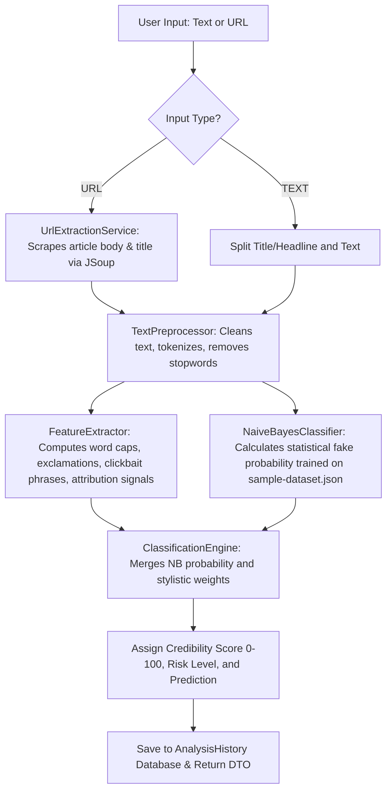

# Veritas: Fake News Detection Web Application

Veritas is a complete, production-style, college-level B.Tech Artificial Intelligence and Data Science project built using **Java** and **Spring Boot 3.x**. It analyzes news headlines, articles, and URLs to evaluate their stylistic patterns and classify them as **Likely Genuine**, **Likely Fake**, or **Uncertain**.

---

## 1. Project Overview

Veritas is designed to address the spread of misinformation by highlighting style markers and linguistic patterns. It acts as an **AI-assisted news analysis engine**, evaluating *how* an article is written (stylometric profiling) rather than acting as an absolute fact-checking authority.

### Key Terminology & Approach
- **Likely Genuine / Likely Fake**: We explicitly avoid declaring absolute factuality. Predictions represent classification likelihoods.
- **Confidence Score (0-100)**: Evaluates structural and vocabulary credibility.
- **Risk Indicators**: Stylistic signatures like excessive punctuation, sensational words, or clickbait phrases.
- **Automated Classification**: Veritas is a style analyzer, not an oracle.

---

## 2. Features

- **Text Scanner**: Analyze pasted news headlines and articles.
- **URL Scraper**: Safely retrieve, clean (remove menus, footers, scripts), and analyze live web articles using Jsoup.
- **Hybrid Classification**: Pure Java implementation of a Multinomial Naive Bayes classifier combined with weighted style rules.
- **Explainability Logs**: Transparent, readable indicators detailing why the system reached its classification.
- **Interactive Dashboard**: Aggregated historical metrics, charts (Timeline, Risk Distribution, Category Breakdown) powered by Chart.js.
- **Analysis History**: Paginated, searchable, and filterable log database.
- **RESTful APIs**: Exposes endpoints for analysis, dashboard data, health status, and history.

---

## 3. Technology Stack

- **Backend**: Java 17, Spring Boot 3.2.5, Spring Web, Spring Data JPA, Spring Validation.
- **Database**: H2 (In-Memory Database) with persistence support (structured to easily switch to PostgreSQL/MySQL).
- **Web Scraper**: Jsoup 1.17.2.
- **Frontend**: HTML5, Thymeleaf, custom CSS3 (Glassmorphic cards, responsive grids), Vanilla JS, Chart.js.
- **Testing**: JUnit 5, Spring Boot Test.
- **Build Tool**: Apache Maven.

---

## 4. Project Structure

```text
fakenews-detector/
│
├── src/
│   ├── main/
│   │   ├── java/
│   │   │   └── com/example/fakenewsdetector/
│   │   │       ├── FakeNewsDetectorApplication.java
│   │   │       ├── controller/
│   │   │       │   ├── AnalysisApiController.java
│   │   │       │   └── WebController.java
│   │   │       ├── service/
│   │   │       │   ├── TextPreprocessor.java
│   │   │       │   ├── FeatureExtractor.java
│   │   │       │   ├── NaiveBayesClassifier.java
│   │   │       │   ├── ClassificationEngine.java
│   │   │       │   └── UrlExtractionService.java
│   │   │       ├── repository/
│   │   │       │   └── AnalysisHistoryRepository.java
│   │   │       ├── model/
│   │   │       │   ├── Prediction.java
│   │   │       │   ├── RiskLevel.java
│   │   │       │   └── AnalysisHistory.java
│   │   │       ├── dto/
│   │   │       │   ├── AnalysisRequest.java
│   │   │       │   ├── AnalysisResponse.java
│   │   │       │   └── DashboardStats.java
│   │   │       └── exception/
│   │   │           ├── UrlExtractionException.java
│   │   │           └── GlobalExceptionHandler.java
│   │   │
│   │   └── resources/
│   │       ├── templates/
│   │       │   └── index.html
│   │       ├── static/
│   │       │   ├── css/
│   │       │   │   └── main.css
│   │       │   └── js/
│   │       │       └── app.js
│   │       ├── application.properties
│   │       └── sample-dataset.json
│   │
│   └── test/
│       └── java/
│           └── com/example/fakenewsdetector/
│               ├── TextPreprocessorTest.java
│               ├── FeatureExtractorTest.java
│               ├── ClassificationEngineTest.java
│               └── AnalysisApiControllerTest.java
│
├── pom.xml
└── README.md
```

---

## 5. How the Detection System Works

The system operates a multi-stage classification pipeline:



### Hybrid Score Heuristics
1. **Machine Learning Base**: Multinomial Naive Bayes computes the probability of text class (Real vs. Fake) based on word-token frequencies:
   $$\log P(label | tokens) \propto \log P(label) + \sum_{token} \log P(token | label)$$
   We convert this to a stable probability using the softmax differences:
   $$P(Fake) = \frac{1}{1 + e^{\log P(Real) - \log P(Fake)}}$$
2. **Stylometric Rules Adjustment**:
   - **Clickbait Phrases**: Penalizes score (-15 pts per match, max -30).
   - **Sensational Words**: Penalizes score (-6 pts per match, max -24).
   - **Excessive Capitalization**: Penalizes if ALL_CAPS words ratio > 15% (-15 pts).
   - **Exclamation Marks**: Penalizes if exclamation ratio is high (-12 pts).
   - **Attribution Signals**: Awards score if source citations (e.g., "reported by", "according to") are found (+10 pts per match, max +25). If absent, penalizes (-10 pts).
   - **Urls & Numbers**: Awards minor scores (+5 and +3 respectively) representing citations and dates.

---

## 6. Dataset Information

The classifier trains on startup using `src/main/resources/sample-dataset.json`. It contains labeled balanced articles representing:
- **Sensationalism**: Heavy capitalization, alarmist terminology, clickbait verbs.
- **Factual reporting**: Press releases (e.g. Federal Reserve, NASA), city council notes, scientific logs containing dates, attribution, and neutral verbs.

*Note: The built-in dataset is for system training demonstration and is not meant to represent real-world clinical model accuracy.*

---

## 7. How to Run the Application

### Prerequisites
- **Java 17 JDK** or higher.
- **Maven** (A Maven installation is recommended. Alternatively, you can run using the absolute paths configured).

### Steps
1. Navigate to the project root folder:
   ```bash
   cd C:\Users\mail2\.gemini\antigravity\scratch\fakenews-detector
   ```
2. Build the project:
   ```bash
   mvn clean package
   ```
3. Run the Spring Boot application:
   ```bash
   mvn spring-boot:run
   ```
4. Access the web interface:
   Open your browser and navigate to `http://localhost:8080`.

---

## 8. Database Structure

The H2 database uses a table named `analysis_history` mapping the `AnalysisHistory` entity:

| Field Name | Type | Description |
|---|---|---|
| `id` | `BIGINT` | Primary Key, Auto-increment |
| `input_type` | `VARCHAR` | "TEXT" or "URL" |
| `original_input` | `CLOB / TEXT` | Raw text input or scraped URL |
| `title` | `VARCHAR(500)` | Extracted article title or headline |
| `analyzed_text` | `CLOB / TEXT` | Scraped or parsed text body |
| `prediction` | `VARCHAR` | "LIKELY_FAKE", "LIKELY_GENUINE", "UNCERTAIN" |
| `confidence_score`| `DOUBLE` | Computed credibility score (0 - 100) |
| `risk_level` | `VARCHAR` | "LOW", "MEDIUM", "HIGH" |
| `explanation` | `VARCHAR(1000)` | Comma-separated stylistic indicator tags |
| `timestamp` | `TIMESTAMP` | Execution date-time stamp |
| `word_count` | `INTEGER` | Word count |
| `character_count` | `INTEGER` | Character count |

---

## 9. API Documentation

### 1. Analyze Content
- **Endpoint**: `POST /api/analyze`
- **Request Body**:
  ```json
  {
    "text": "The Department of Energy announced $100M in funding today for clean energy research hubs. Stated by officials, the decision was confirmed by Oxford researchers.",
    "url": "",
    "inputType": "TEXT"
  }
  ```
- **Response Body**:
  ```json
  {
    "id": 1,
    "inputType": "TEXT",
    "prediction": "LIKELY_GENUINE",
    "confidenceScore": 88.0,
    "riskLevel": "LOW",
    "indicators": [
      "Contains verifiable source attribution signals (2)",
      "Includes factual numbers/dates",
      "Text characteristics fall within normal baseline ratios"
    ],
    "wordCount": 24,
    "characterCount": 160,
    "sentenceCount": 2,
    "exclamationCount": 0,
    "questionCount": 0,
    "capitalizedWordsCount": 0,
    "title": "The Department of Energy announced $100M in funding...",
    "originalText": "The Department of Energy announced $100M in funding today for clean energy research hubs. Stated by officials, the decision was confirmed by Oxford researchers.",
    "formattedTimestamp": "2026-08-23 17:40:00"
  }
  ```

### 2. Retrieve Logs History
- **Endpoint**: `GET /api/history?page=0&size=10&query=nuclear&prediction=LIKELY_FAKE`
- **Response**: Spring Page object containing content items, size, page counts.

### 3. Retrieve Dashboard Stats
- **Endpoint**: `GET /api/dashboard`
- **Response**: Aggregated counts, average confidence, timeline series labels.

### 4. Delete Log
- **Endpoint**: `DELETE /api/history/{id}`
- **Response**: `204 No Content`

### 5. Health Check
- **Endpoint**: `GET /api/health`
- **Response**: `{"status":"UP","classifierTrained":true}`

---

## 10. Testing Instructions

To run automated unit and integration tests, run the following command:
```bash
mvn test
```
The test suite validates:
- Punctuation removal, word lowercasing, and repeated character contraction in pre-processors.
- Clickbait and capitalization matches in feature extractors.
- Probability classification consistency in Naive Bayes.
- Correct risk level mappings in the decision engine.
- HTTP statuses on controller REST endpoints.

---

## 11. Reflections and Limitations (AI & DS Academic Context)

### Difference between Classification Confidence and Factual Truth
Veritas detects *structural bias* and *stylistic sensationalism*. A factual article written with terrible grammar, clickbait titles, and multiple exclamation marks might score as "Likely Fake" due to its writing style. Conversely, a highly polished, professional-looking lie written in a neutral, calm academic tone might score as "Likely Genuine".

### Limitations of Text-Only News Detection
- **Tone Mimicry**: Disinformation agencies write fake reports mimicking the style of Reuters or the AP, bypassing style classifiers.
- **Satire**: Satirical pieces (e.g. *The Onion*) resemble fake news in structure but lack malicious intent.
- **Context Ignorance**: Pure NLP classifiers do not know if an event actually occurred in the physical world.

### Why Source Verification is Difficult
Scraping can extract text, but verifying whether a website domain is authoritative requires external DNS validation, cross-checking registration databases, reviewing whitelist directories, and maintaining updated blacklists.

### Future Improvements
1. **Retrieval-Augmented Generation (RAG)**: Connect the backend to a search index API to check if other mainstream news organizations have published reports about the same headline.
2. **Domain Trust Indexing**: Maintain a database of verified news domains to cross-verify extracted article sources.
3. **Advanced Transformer Models**: Replace the basic Naive Bayes classifier with a pre-trained BERT or RoBERTa network fine-tuned on news datasets.
